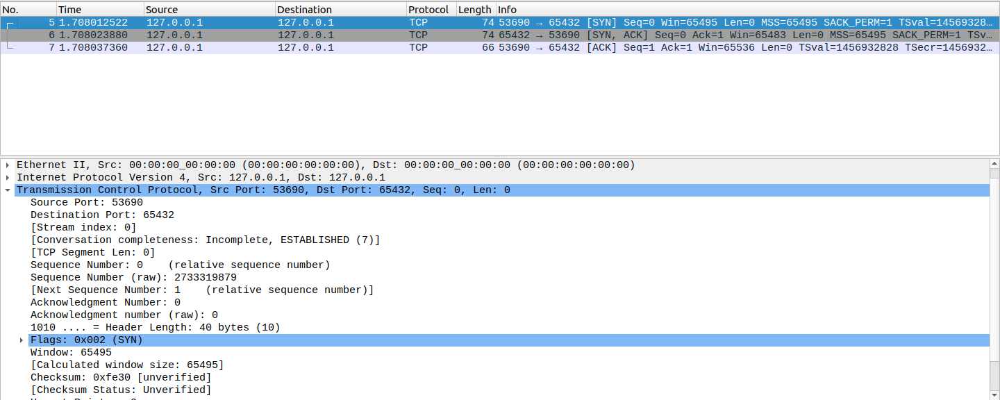
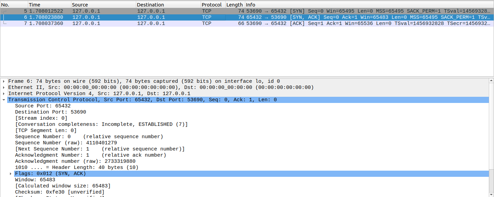
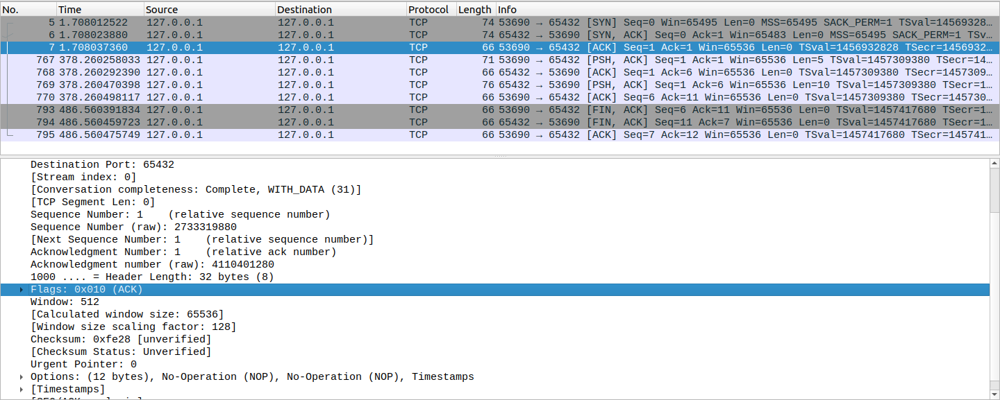
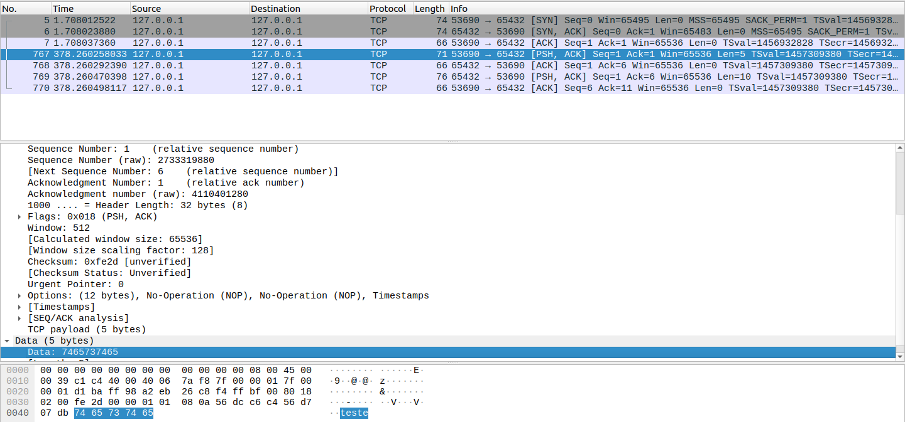
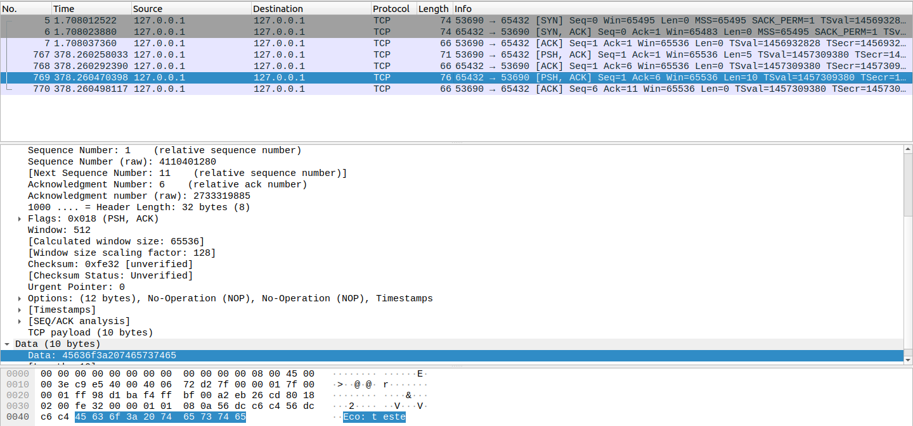
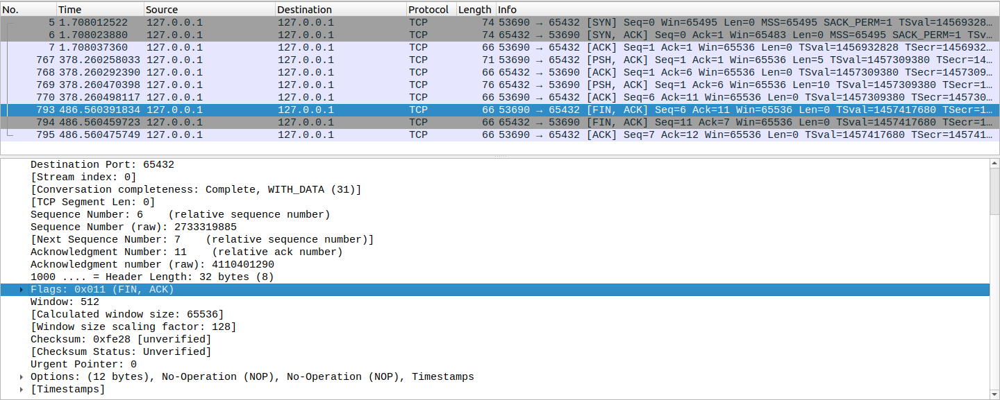
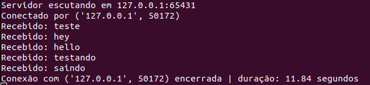
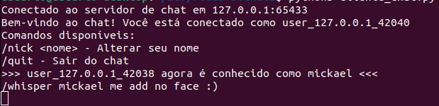
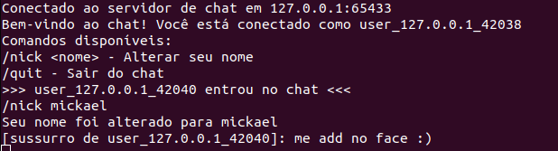
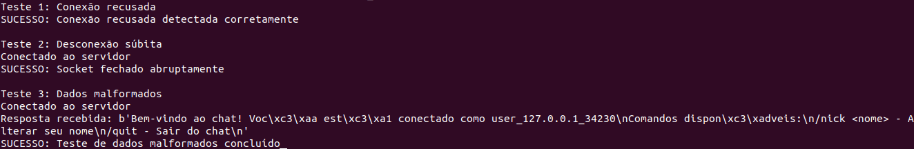

# Análises do laboratório

## Parte 3: Análise de tráfego com Wireshark

#### Three-way handshake para estabelecer conexão entre cliente e servidor

SYN:

SYN-ACK:

ACK:

#

#### Envio de mensagem pelo cliente e eco do servidor

Envio:

Eco:

#

#### Fechamento de conexão quando o cliente sai

FIN-ACK:

#

#### Desafio extra: servidor mostrando duração da conexão com cliente

#

#### Desafio extra: comando de sussurro /whisper

Visão de quem sussurrou:

Visão de quem recebeu o sussurro:

## Testes de resiliência

Resultados dos testes:

Como pode ser visto, todos os testes obtiveram sucesso.